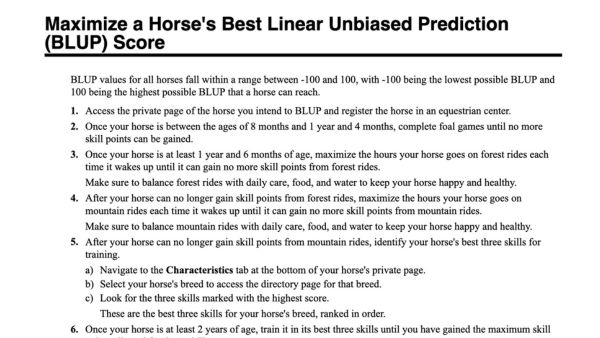
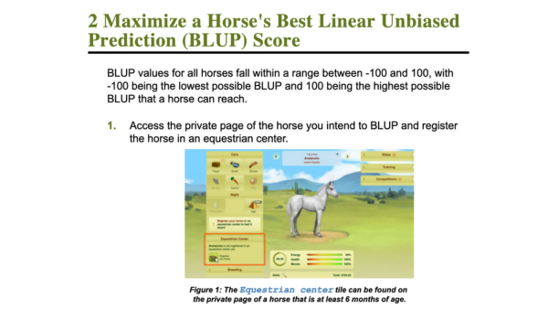

# Summary Report: Plain-Language Editing & Design

Authors: Kelly Rogers and Caimile Loy | [Google Doc: Topic Model 4 Style Guide](https://docs.google.com/document/d/1qJ6ESwHqPcD-eb_eruIBBK20WwHTvbpj_pXOOpNDF4I/edit?usp=sharing)

## Topic Model Revisions
We made the suggested revisions based on the feedback that you gave on our topic model: We have included pictures where it is helpful and adjusted our text so that the indentations allows us to collapse individual elements down in VS Code.

## Document Design
When it came to design, we made sure to make choices that kept our document simple and easy to read.

### Colors
We decided that our documentation should exhibit and match the same colors that the game's user interface (UI) uses most often. This includes a combination of greens, blues, tans, and golds. We grabbed screenshots of the UI and plugged them into a hex code generator that gave us a spectrum of colors to work with.

### Fonts, Size, & Spacing
Since it seems to be a standard in the industry to use serif fonts as headings and sans-serif fonts as non-headings, Kelly and I opted to use the serif font Average as our font for headings and the sans-serif font Poppins as the regular copy font. However, the title font is Archivo Black, because we wanted something that was simultaneously simple and bold. Additionally, we took the time to comb through each font and assign appropriate sizes and spacings. Ideally, we wanted there to be a little bit of space in between regular paragraphs of text with bigger spaces in between different sections on a page. On top of this, we also managed to resize and center the caption text beneath images. It's a little bittle smaller and has been italicized so that it doesn't get in the way of reading the actual regular copy.

**BEFORE DESIGN EDITING:**

**AFTER DESIGN EDITING:**

## Written Editing Work

### Macro-Level Content Organization

We combed through our topic model and made sure that topics of the same category (concept, reference, task) follow similar flows in how the content in them is organized. For example, our concept topics introduce a concept, define that concept, and then state how that concept is relevant or noteworthy to the reader.

[**c_about_affix**](concepts/c_about_affix.dita)

- Introduce: "About affixes"
- Define: "The italicized, hyperlinked text beneath a horse's name is the horse's affix."
- Contextualize: "Breeders apply affixes to horses as a way to identify and market different bloodlines in the game."

[**c_about_blup**](concepts/c_about_blup.dita)

- Introduce: "BLUP is displayed under the <uicontrol>Genetics</uicontrol> tab of a horse's private page."
- Define: "BLUP is a genetic index for horses. BLUP values for all horses fall within a range between -100 and 100, with -100 being the lowest possible BLUP and 100 being the highest possible BLUP."
- Contextualize: "The Best Linear Unbiased Prediction (BLUP) plays an important role in breeding horses because the BLUP values of the parent horses impact a foal's genetic potential and innate skills."

### Passive to Active Voice
To apply Lanham's Paramedic Method when editing our work, we went through and changed instances of passive voice to active voice. This allowed us to heavily cut back on the amount of words used in our topic model and be more forward and straight-to-the-point about what we're trying to tell readers. Here are some examples:

[**c_about_coverings**](concepts/c_about_coverings.dita)

- Before: "These coverings are only given out by stallions with the team affix."
- After: "Only stallions with the team affix give out these coverings."

[**r_breeding_bmis**](references/r_breeding_bmis.dita)

- Before: "Aphrodite's Tears: The inborn skills of a foal that will be born are increased by 50%."
- After: "Aphrodite's Tears: Increase a foal's inborn skills by 50%."

[**t_maximize_blup**](tasks/t_maximize_blup.dita)

- Before: "Completion of training is indicated by the meters in the Training tile on your horse's private page."
- After: "The Training tile meters indicate your horse's training progress and completion."

### Remove Unnecessary Words

Another strategy we utilized was reducing instances of unnecessary language. In particular, we were able to delete many prepositional sentence fragments that were superfluous to the meaning of the topics. These changes reduced the wordiness of the sentence and resulted in a more concise sentence. Here are some examples:

[**t_reserve_affix**](tasks/t_reserve_affix.dita)

- Before: "Before reserving and applying an affix **to a horse**, you'll need at least 30 days of seniority **on the game**."
- After: "Before reserving and applying an affix, you'll need at least 30 days of seniority."

[**r_foal_games**](references/r_foal_games.dita)

- Before: "A foal can begin foal games at 8 months of age through the time it reaches 1 year and 4 months of age."
- After: "A foal can play foal games from 8 months to 1 year 4 months old."

[**t_maximize_blup**](tasks/t_maximize_blup.dita)
- Before: "Once your horse is at least 5 years old, select its competition specialty and give it tack to enter competitions."
- After: "Once your horse is at least 5 years old, select a competition specialty and give it tack."

[**t_maximize_blup**](tasks/t_maximize_blup.dita)
- Before: "**To speed up the process of** securing 20 first-place wins **for your horse**, enter filler horses into the same competitions as the horse you are trying to BLUP to force the competitions to run faster."
- After: "**Quickly secure 20 first-place wins** by entering filler horses into the same competitions as the horse you are BLUPing."

### Keep Everything in Present Tense

There were many instances where future and/or past tense was used in a sentence instead of present tense. We made sure that everything was written in present tense. This helped cut back on the amount of words used in sentences and maintained consistency in writing.

[**r_foal_games**](references/r_foal_games.dita)
- Before: "Different combinations of care and playtime with a foal during those months **will result** in varying amounts of skill points gained."
- After: "Different combinations of care and playtime **determine** the skill points gained."

[**t_maximize_blup**](tasks/t_maximize_blup.dita)
- Before: "Enter your horse into those competitions until its best three skills **have gained** the maximum skill points possible."
- After: "Enter your horse into those competitions until its best three skills **gain** the maximum skill points."